# MoreWaita

[](https://www.gnu.org/licenses/gpl-3.0)  

An expanded Adwaita-styled companion icon theme, built largely upon the work of GNOME's Adwaita designers and GNOME Circle apps' developers, as well as inspiration from the Papirus icon theme designers, and a touch of tinkering from myself and [a few others](https://github.com/somepaulo/MoreWaita/graphs/contributors).

<details>
<summary><h3>About the theme</h3> <em>(expand)</em></summary>

The purpose of this theme is to provide third-party apps with a consistent look and feel in Gnome Shell.

The goal of MoreWaita is to add to Adwaita, not modify it, and to do roughly what Breeze does for KDE. This theme does not override any Adwaita icons, nor any Gnome Circle apps icons, nor icons that generally fit into the Adwaita paradigm (like Transmission GTK). Currently, this theme is way less all-inclusive than many others, but the aim is to be on par with Papirus some day. However, this is (mostly) a one-man hobby effort, albeit with some greatly appreciated help, so suggestions, requests, PRs and contributions are very welcome. Please read CONTRIBUTING.md before submitting PRs.

For most icons, especially branded ones, the general idea is to stay as close as possible to the original icons – to the point of using them in full – and giving them the distinct Adwaita 'perspective' and general flatness. One thing this theme deviates from is the Gnome colour palette in brand icons – MoreWaita keeps the brand colours.

This theme is built and tested against vanilla Gnome on Arch Linux. If an icon is in the theme, but is not applying to your app, please open an issue and mention the icon name referenced in your app's `.desktop` file.
</details>

## The icons

_These are the icons currently in git, versioned theme releases will be behind most of the time_
<details>
<summary><h3>Apps</h3> <em>(expand)</em></summary>


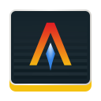

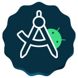


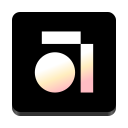


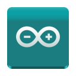


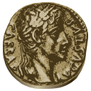


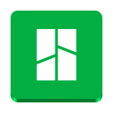


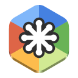


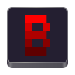


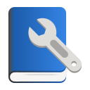


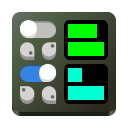


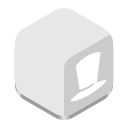
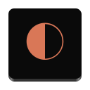
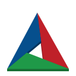


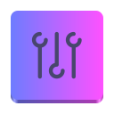


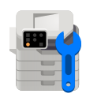

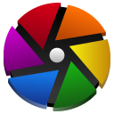


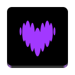

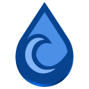
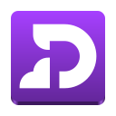


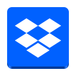
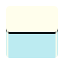


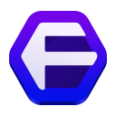
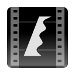

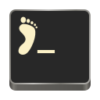


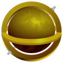

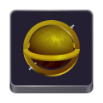


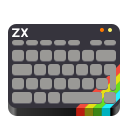

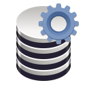


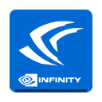


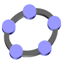

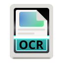


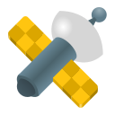
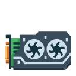
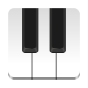
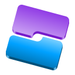
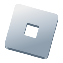


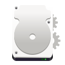
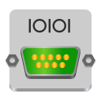


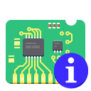
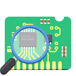

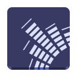


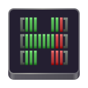
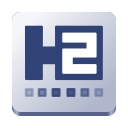


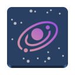

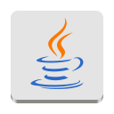

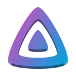

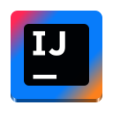

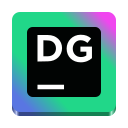
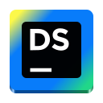


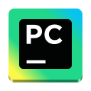


")


")


</details>
<details>
<summary><h3>MIME types</h3> <em>(expand)</em></summary>


</details>
<details>
<summary><h3>Devices</h3> <em>(expand)</em></summary>


</details>
<details>
<summary><h3>Places</h3> <em>(expand)</em></summary>


</details>
<details>
<summary><h3>Legacy</h3> <em>(expand)</em></summary>

#### Apps & MIME types


#### Categories


#### Preferences


#### Actions


#### Places


</details>

## Installation

> [!IMPORTANT]
> This theme requires the Adwaita icon theme in order to work.

#### Manual installation & update

System-wide installation into `/usr/share/icons/` (**recommended** – some apps don't work well with local user installations):

```sh
git clone https://github.com/somepaulo/MoreWaita.git && cd MoreWaita && sudo ./install.sh
```

Local user installation into `~/.local/share/icons/`:

```sh
git clone https://github.com/somepaulo/MoreWaita.git && cd MoreWaita && ./install.sh
```

##### Uninstall

Simply choose another theme and then delete the entire `MoreWaita` folder from either `/usr/share/icons/` or `~/.local/share/icons/` depending on your installation choice above.

#### Arch Linux

[AUR package (versioned)](https://aur.archlinux.org/packages/morewaita-icon-theme)

```sh
paru morewaita-icon-theme
```

<sup>_*Replace `paru` with `yay -S` or your other favourite AUR helper install command._</sup>

[AUR package (git)](https://aur.archlinux.org/packages/morewaita-icon-theme-git)

```sh
paru morewaita-icon-theme-git
```

<sup>_*Replace `paru` with `yay -S` or your other favourite AUR helper install command._</sup>

[Julian's repository](https://gitlab.com/julianfairfax/package-repo#how-to-add-repository-for-arch-based-linux-distributions)

#### Fedora Linux

Install via [@trixieua's COPR](https://copr.fedorainfracloud.org/coprs/trixieua/morewaita-icon-theme):

```sh
dnf copr enable trixieua/morewaita-icon-theme && dnf install morewaita-icon-theme
```

#### Ubuntu/Debian Linux

[Julian's repository](https://gitlab.com/julianfairfax/package-repo#how-to-add-repository-for-debian-based-linux-distributions)

#### nixOS

Install via [pkosel's package](https://search.nixos.org/packages?channel=unstable&show=morewaita-icon-theme):

```sh
nix-shell -p morewaita-icon-theme
```

## Activation

Either use the `Refine` or `Tweaks` app to choose and activate the icon theme or run the following command:

```sh
gsettings set org.gnome.desktop.interface icon-theme 'MoreWaita'
```

## Using custom folder icons

### GUI method

1. Open Files (Nautilus).
2. Find the folder you wish to change the icon for.
3. Right click on the folder and click on `Properties` **or** press `Alt+Enter`.
4. Click on the _Set Custom Icon_ badge on the folder image.
5. Navigate to the MoreWaita installation folder and into the `places` subfolder (typically `/usr/share/icons/MoreWaita/scalable/places/`).
6. Select the icon you wish to use.
7. Click `Select`.
8. Follow the same procedure to choose a different icon or click the _'Remove Custom Icon'_ badge to revert the icon to the default in step 4.


### CLI method

If you need to assign the icons using the CLI you have to use the GIO command-line tool.

- Set a custom icon on a folder (Projects in ~ for this example):

    ```sh
    gio set $HOME/Projects metadata::custom-icon-name "folder-projects"
    ```

<sup>_*This will persist the custom icon across themes as long as they provide an icon with the same name._</sup>

- You can confirm the change showing the `custom-icon-name` attribute with:

    ```sh
    gio info $HOME/Projects | grep custom-icon-name
    ```

- To delete the `custom-icon-name` attribute use `-d` flag:

    ```sh
    gio set -d $HOME/Projects metadata::custom-icon-name
    ```

Alternatively, if you prefer to automate things using a list of folders, take a look at the [custom_folder_icons.sh](./_extras/custom_folder_icons.sh) script by [@hasecilu](https://github.com/hasecilu). You can change it to your needs and add it to your dotfiles.

## Accent colours support

To have folders and some Gnome apps support the accent colours introduced in Gnome 47, install `adwaita-colors-icon-theme` or `adwaita-colors-icon-theme-git` from the AUR or directly from the [theme's repo](https://github.com/dpejoh/Adwaita-colors).

## Troubleshooting

#### Theme doesn't apply

If the theme doesn't apply try the following command:

For system-wide installation:

```sh
sudo gtk-update-icon-cache -f -t /usr/share/icons/MoreWaita && xdg-desktop-menu forceupdate
```

For local installation:

```sh
gtk-update-icon-cache -f -t ~/.local/share/icons/MoreWaita && xdg-desktop-menu forceupdate
```

#### Some apps don't get themed

If the theme applies, but a particular app doesn't get themed (and its icon is in MoreWaita), check its respective `.desktop` file. Some apps have icon paths hardcoded into their `.desktop` file or have a different icon name set there or no icon set at all. This can differ between distros.

If you happen to have such apps, you'll need to copy their `.desktop` files into `~/.local/share/applications` and modify them there providing the correct icon name. Alternatively, use a menu editor like `Main Menu`, `MenuLibre` or `Alacarte`.

If your app's `.desktop` file references an icon name not present in MoreWaita's `scalable/apps` folder, please report it in an issue providing the icon name from your system.

#### Some mime types don't apply

If some mime type icons are not getting applied to the respective file types, your system might not have these mime types registered or have them assigned to different file types with the same extension (like `.key` files that can be either Keynote presentations or PGP keys). In this case you need to create the respective `.xml` files for the missing mime types and add them to your system for the icons to apply.

You can use the `.xml` files from the `_extras` folder or create your own as needed.

For system-wide installation, put the `.xml` files into `/usr/share/mime/packages/` and run:

```sh
sudo update-mime-database /usr/share/mime
```

For local installation, put the `.xml` files into `~/local/share/mime/packages/` and run:

```sh
update-mime-database ~/.local/share/mime
```
