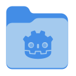

> [!NOTE]
> v46 was skipped due to many reasons. The project is still maintained. v47 coming out early October. Stay tuned.

# MoreWaita


## Introduction

An expanded Adwaita-styled companion icon theme, built largely upon the work of GNOME's Adwaita designers and GNOME Circle apps' developers, as well as inspiration from the Papirus icon theme designers, and a touch of tinkering from myself, [@dusansimic](https://github.com/dusansimic), [@julianfairfax](https://github.com/julianfairfax) and [a few others](https://github.com/somepaulo/MoreWaita/graphs/contributors).

<details>
<summary><h4>About the theme</h4></summary>

The purpose of this theme is to provide third-party apps with a consistent look and feel in Gnome Shell.

The goal of MoreWaita is to add to Adwaita, not modify it, and to do roughly what Breeze does for KDE. This theme does not override any Adwaita icons, nor any Gnome Circle apps icons, nor icons that generally fit into the Adwaita paradigm (like Transmission GTK). Currently, this theme is way less all-inclusive than many others, but the aim is to be on par with Papirus some day. However, this is (mostly) a one-man hobby effort, albeit with some greatly appreciated help, so suggestions, requests, PRs and contributions are very welcome. Please read CONTRIBUTING.md before submitting PRs.

For most icons, especially branded ones, the general idea is to stay as close as possible to the original icons – to the point of using them in full – and giving them the distinct Adwaita 'perspective' and general flatness. One thing this theme deviates from is the Gnome colour palette in brand icons – MoreWaita keeps the brand colours.

This theme is built and tested against vanilla Gnome on Arch Linux. If an icon is in the theme, but is not applying to your app, please open an issue and mention the icon name referenced in your app's `.desktop` file.
</details>

## The icons

_These are the icons currently in git, versioned theme releases will be behind most of the time_
<details>
<summary><h3>Apps</h3></summary>


</details>
<details>
<summary><h3>MIME types</h3></summary>


 

 


 


</details>
<details>
<summary><h3>Places</h3></summary>





### Legacy Places


</details>

## Installation

> [!IMPORTANT]
> This theme requires the Adwaita icon theme in order to work.

#### Manual installation & update

System-wide installation into `/usr/share/icons/` (**recommended** – some apps don't work well with local user installations):

```sh
git clone https://github.com/somepaulo/MoreWaita.git && cd MoreWaita && sudo ./install.sh
```

Local user installation into `~/.local/share/icons/`:

```sh
git clone https://github.com/somepaulo/MoreWaita.git && cd MoreWaita && ./install.sh
```

##### Uninstall

Simply chose another theme and then delete the entire `MoreWaita` folder from either `/usr/share/icons/` or `~/.local/share/icons/` depending on your installation choice above.

#### Arch Linux

[AUR package (versioned)](https://aur.archlinux.org/packages/morewaita)

```sh
paru morewaita
```

[AUR package (git)](https://aur.archlinux.org/packages/morewaita-git)

```sh
paru morewaita-git
```

[Julian's repository](https://gitlab.com/julianfairfax/package-repo#how-to-add-repository-for-arch-based-linux-distributions)

#### Fedora Linux

Install via [@dusansimic's COPR](https://copr.fedorainfracloud.org/coprs/dusansimic/themes):

```sh
dnf copr enable dusansimic/themes && dnf install morewaita-icon-theme
```

#### Ubuntu/Debian Linux

[Julian's repository](https://gitlab.com/julianfairfax/package-repo#how-to-add-repository-for-debian-based-linux-distributions)

## Activation

Either use the `Tweaks` app to choose and activate the icon theme or run the following command:

```sh
gsettings set org.gnome.desktop.interface icon-theme 'MoreWaita'
```

## Using custom folder icons

### GUI method

1. Open Files (Nautilus).
2. Find the folder you wish to change the icon for.
3. Right click on the folder.
4. Click on `Properties`.
5. Click on the folder image.
6. Navigate to the MoreWaita installation folder and into the `places` subfolder (typically `/usr/share/icons/MoreWaita/places/scalable/`).
7. Select the icon you wish to use.
8. Click `Open`.
9. Follow the same procedure to revert the icon. Just click `Revert` instead of selecting a new icon in step 7.


### CLI method

If you need to assign the icons using the CLI you have to use the GIO command-line tool.

- Set a custom (C programming language) icon on a folder:

    ```sh
    gio set $HOME/Coding/C metadata::custom-icon \
           file:///usr/share/icons/MoreWaita/places/scalable/folder-c.svg
    ```

- You can confirm the change showing the `metadata::custom-icon` attribute with:

    ```sh
    gio info --attributes="metadata::custom-icon" $HOME/Coding/C
    ```

- To delete the `metadata::custom-icon` attribute use `-d` flag:

    ```sh
    gio set $HOME/Coding/C metadata::custom-icon -d
    ```

## Troubleshooting

#### Theme doesn't apply

If the theme doesn't apply try the following command:

For system-wide installation:

```sh
sudo gtk-update-icon-cache -f -t /usr/share/icons/MoreWaita && xdg-desktop-menu forceupdate
```

For local installation:

```sh
gtk-update-icon-cache -f -t ~/.local/share/icons/MoreWaita && xdg-desktop-menu forceupdate
```

#### Some apps don't get themed

If the theme applies, but a particular app doesn't get themed (and its icon is in MoreWaita), check its respective `.desktop` file. Some apps have icon paths hardcoded into their `.desktop` file or have a different icon name set there or no icon set at all. This can differ between distros.

If you happen to have such apps, you'll need to copy their `.desktop` files into `~/.local/share/applications` and modify them there providing the correct icon name. Alternatively, use a menu editor like `Main Menu`, `MenuLibre` or `Alacarte`.

If your app's `.desktop` file references an icon name not present in MoreWaita's `apps/scalable` folder, please report it in an issue providing the icon name from your system.
